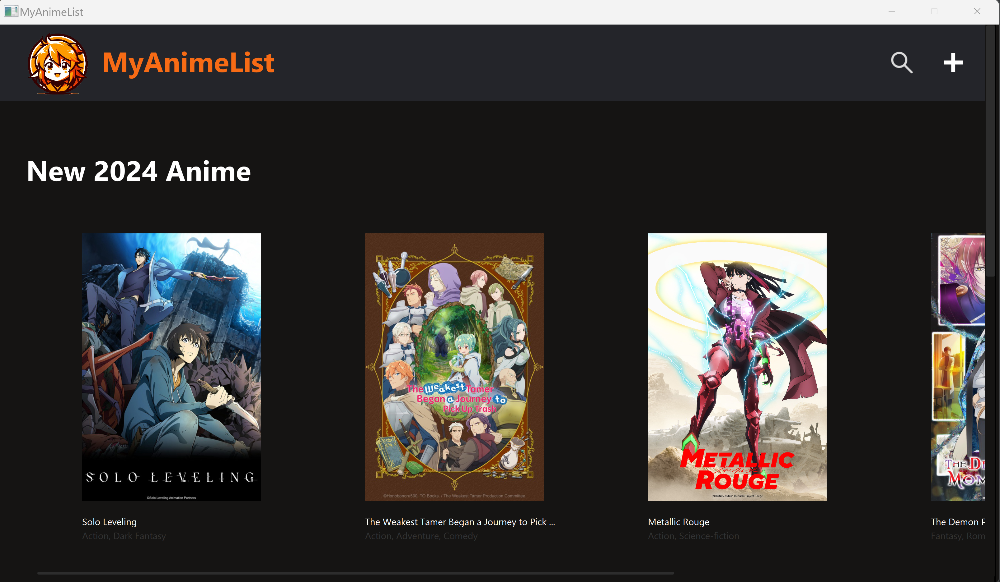

# My Anime List ⊂(◉‿◉)つ

Welcome to My Anime List ! This project can manage Animes



# Prerequisite ⏪

Somes knowledges in this field :

- The use of Java
- The use of Git and for the code management

# Installation 🔧

1. Clone the repository.
```bash
  git clone https://github.com/B1-Info-23-24/projet-java-MounKilian.git
```
2. Reach in the repository.
```bash
  cd MyAnimeList
```

# Start 🧑‍💻

1. Run 'MainApp'


2. Your application is running

# How To Use ? 🔨

1. When the application is running you are in the home page, you can find all of anime already create. You have two differents vous avez deux différentes catégories "New 2024 animes" et 'Emblematic Anime". Vous pouvez clicker sur les animes pour avoir plus d'information. On the header you can find the magnifying glass to access the search bar and a plus to add anime. In the footer you'll find my contacts.


2. When you click on an anime, you can read all its information. You can also change the reading status and give your opinion on the anime. You can also delete or modify an anime. To return to the basic screen, click on the MyAnimeList logo.


3. If you modify or create an anime, it will appear at the end of "New 2024 Anime". You can import your image, you have to download your image in this path : /MyAnimeList/src/main/ressources/img/ and then you can import when you add anime.


4. When you do a search you can select an anime to get more information. You can also use filters to sort anime by genre. Anime are sorted alphabetically.

# Others 🎨

1. You can find my mockup Figma here : https://www.figma.com/file/WwMHwe0xs7NQOtD6wzAiKr/MyAnimList?type=design&node-id=0%3A1&mode=design&t=8Oz2OV4JBrOskMFj-1


2. You can find my notion page here : https://www.notion.so/Java-Project-MyAnimeList-a6df5371884643ea88939c9c6c1b316d?pvs=4

# Version 🗃️

- openjdk-21 Oracle OpenJDK version 21.0.2

# Authors 💸

- [Kilian Moun 🍻](https://github.com/MounKilian)